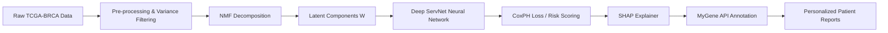

# DeepSurv-NMF: Explainable Deep Survival Analysis on Transcriptomic Data

[](https://python.org)
[](https://pytorch.org)
[](https://www.cancer.gov/tcga)
[](https://shap.readthedocs.io/)

**DeepSurv-NMF** is an end-to-end computational pipeline for predicting patient survival outcomes from high-dimensional gene expression data (TCGA-BRCA). It combines biologically-inspired dimensionality reduction (NMF) with deep neural networks and SHAP-based interpretability to bridge the gap between "black-box" AI and precision oncology.

## 🧬 Scientific Problem
Analyzing transcriptomic data (20,000+ genes) for clinical prognosis is challenging due to the high dimensionality and the "curse of dimensionality." Standard models often fail to provide biological context. DeepSurv-NMF addresses this by decomposing gene expressions into functional components before training a deep survival model.

## 🚀 Key Features

- **Biologically-Inspired Embedding:** Uses **Non-negative Matrix Factorization (NMF)** to reduce 20,000+ genes into $N=12$ latent components representing distinct biological processes.
- **Deep Survival Engine:** A custom PyTorch-based **ServNet** architecture utilizing **Cox Proportional Hazards Loss** for handling censored survival data.
- **Explainable AI (XAI):** Integrated **SHAP (SHapley Additive exPlanations)** values to quantify the contribution of each genetic component to a patient's risk score.
- **Automated Annotation:** Dynamic integration with the **MyGene.info API** to fetch real-time functional descriptions of top-contributing genes.
- **Personalized Reporting:** Generates patient-specific JSON dossiers containing risk scores, SHAP contributions, and detailed gene ontologies for clinical decision support.

## 🏗️ System Architecture



## 🛠️ Technical Implementation

### **1. Latent Feature Extraction (NMF)**
Instead of standard PCA, we use NMF to ensure non-negativity, which aligns with biological reality (gene expression levels are never negative). This results in components that often correspond to specific signaling pathways or cellular functions.

### **2. ServNet Architecture**
A deep multi-layer perceptron (MLP) designed for survival regression:
- **Input:** $N=12$ NMF components.
- **Depth:** 6 hidden layers with decreasing width (512 to 64 units).
- **Optimization:** Adam optimizer with `ReduceLROnPlateau` scheduling and Xavier initialization.
- **Loss:** Cox Proportional Hazards Loss for optimized handling of right-censored data.

### **3. Interpretability Pipeline**
- **Global Importance:** Identifying which NMF components drive cancer progression.
- **Local Importance:** Explaining why a specific patient is classified as "High Risk."
- **Gene Mapping:** Automatically mapping the top 20 weighted genes per component to their functional summaries via `mygene`.

## 📊 Performance Metrics

- **C-Index (Concordance Index):** Measures the model's ability to correctly rank patient survival times.
- **Spearman Correlation:** Evaluates the monotonic relationship between predicted risk and actual survival time.
- **Statistical Rigor:** Implements strict seed reproducibility ($SEED=42$) and standard scaling of latent features.

## 📂 Project Structure

```text
📂 project_root
├── BRCA_HiSeqV2.csv        # Gene expression data
├── RRCA_survival.csv       # Clinical survival data (Time, Event)
├── model.py                # ServNet & NMF Implementation
├── Patient_N.json          # Generated personalized reports
└── README.md
```

## ⚙️ Installation & Usage

1. **Requirements:**
```bash
pip install torch pycox sksurv shap mygene scikit-learn pandas matplotlib
```

2. **Execution:**
```bash
python main.py
```

## 🎯 Clinical Impact
By transforming raw expression data into annotated patient reports, DeepSurv-NMF provides oncologists not just with a risk percentage, but with a **biological roadmap** of the genes and pathways driving that risk. This is a step toward truly interpretable AI in the clinic.
